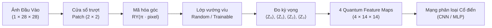

# TÓM TẮT LÝ THUYẾT & NỀN TẢNG NGHIÊN CỨU
## Đề tài: Quanvolutional Neural Networks cho Phân loại Ảnh Y tế (MedMNIST)
**Mốc Báo cáo:** M1 (24/08/2026) — Giai đoạn 0 (Tuần 1 & Tuần 2)  
**Sinh viên thực hiện:** NamIsStudyingCE  

---

## 1. Tổng quan về Mạng Tích chập Lượng tử (Quanvolutional Neural Networks)

Kiến trúc **Quanvolutional Neural Network (QNN)** được đề xuất lần đầu bởi **Maxwell Henderson et al. (2019)** [1], mở rộng ý tưởng của mạng nơ-ron tích chập cổ điển (CNN) bằng cách đưa vào một lớp biến đổi mới gọi là **lớp tích chập lượng tử (Quanvolutional Layer)**.

### 1.1. Cơ chế hoạt động của Bộ lọc Quanvolution (Quanvolutional Filter)
Tương tự như bộ lọc tích chập cổ điển, bộ lọc lượng tử không xử lý toàn bộ ảnh cùng một lúc mà hoạt động trên từng vùng không gian cục bộ (**patch**) kích thước $n \times n$ của ảnh:

$$\mathbf{u}_x \in \mathbb{R}^{n \times n} \xrightarrow{\text{Mã hóa } e} |\psi(u_x)\rangle \xrightarrow{\text{Mạch lượng tử } U} |\phi(u_x)\rangle \xrightarrow{\text{Đo lường } d} f_x \in \mathbb{R}^K$$

1. **Mã hóa (Encoding - $e$):** Ánh xạ $n^2$ giá trị pixel trong patch thành trạng thái lượng tử của $N = n^2$ qubits (ví dụ: patch $2 \times 2 \to 4$ qubits).
2. **Biến đổi lượng tử (Quantum Transformation - $U$):** Áp dụng một chuỗi các cổng lượng tử đơn qubit và hai qubit (vướng víu lượng tử) lên trạng thái $|\psi\rangle$.
3. **Giải mã / Đo lường (Decoding / Measurement - $d$):** Đo giá trị kỳ vọng của toán tử Pauli (thường là Pauli-Z: $\langle Z_j \rangle$) trên từng qubit, trích xuất ra $K$ kênh đặc trưng (Feature Maps).

### 1.2. Ưu thế then chốt trong Kỷ nguyên NISQ (Noisy Intermediate-Scale Quantum)
* **Không đòi hỏi bộ nhớ lượng tử QRAM:** Do chỉ đưa các patch cục bộ rất nhỏ ($2 \times 2$ hoặc $3 \times 3$) vào mạch, QNN không cần tải toàn bộ dữ liệu ảnh lớn vào QRAM.
* **Mạch nông và số lượng qubit ít:** Chỉ cần $4 - 9$ qubits với độ sâu mạch thấp, hoàn toàn khả thi trên các thiết bị lượng tử hiện tại.
* **Chiến lược Tiền tính toán (Precomputation):** Với mạch lượng tử tĩnh cố định (Random circuit), toàn bộ feature maps có thể được tính trước một lần duy nhất, giúp huấn luyện phần cổ điển cực nhanh mà không bị nghẽn thời gian mô phỏng.

---

## 2. Phân biệt Bản chất: Quanvolution (Henderson) vs. QCNN thật (Cong)

Một trong những nhầm lẫn phổ biến trong y văn là đánh đồng mọi mô hình tích chập lượng tử là QCNN. Việc định vị chính xác mô hình là yêu cầu bắt buộc:

| Tiêu chí | **Quanvolutional NN** (Henderson et al., 2019) [1] | **QCNN thật (Quantum CNN)** (Cong et al., 2019) [2] |
| :--- | :--- | :--- |
| **Bản chất kiến trúc** | **Mạng lai (Hybrid Classical-Quantum)** | **Mạng lượng tử biến phân thuần (Fully Quantum VQC)** |
| **Dữ liệu đầu vào** | Dữ liệu cổ điển (Ảnh 2D: MNIST, MedMNIST). | Trạng thái lượng tử thuần $|\psi_{in}\rangle$ (ví dụ: pha tô-pô SPT). |
| **Cơ chế hoạt động** | Mạch lượng tử nhỏ trượt quét trên ảnh $\to$ đo lường ra mảng số thực $\to$ đưa vào mạng nơ-ron cổ điển. | Mạch phân cấp thu nhỏ dần số qubit qua các tầng *Quantum Convolution* và *Quantum Pooling* (đo bớt qubit). |
| **Không gian xử lý** | Đan xen giữa không gian cổ điển và Hilbert. | Hoàn toàn nằm trong không gian trạng thái Hilbert cho đến qubit đo cuối cùng. |
| **Số lượng tham số** | Tham số lượng tử (cố định/trainable) + trọng số mạng cổ điển. | Quy mô tham số tối ưu $O(\log N)$, tránh hiện tượng *Barren Plateaus*. |
| **Định vị trong đề tài** | **Đây là kiến trúc trọng tâm của Luận văn.** | Mô hình đối chứng lý thuyết để phân biệt rõ ràng. |

---

## 3. Phân biệt Random Circuit vs. Trainable Circuit

Trong kiến trúc Quanvolution, lớp mạch lượng tử có 2 dạng biến thể chính:

### 3.1. Random Quanvolution (Mạch ngẫu nhiên cố định - Trọng tâm Giai đoạn 2)
* **Cơ chế:** Các góc quay và cấu trúc cổng vướng víu được khởi tạo ngẫu nhiên một lần (cố định seed) và **không cập nhật trọng số** trong quá trình huấn luyện.
* **Ý nghĩa toán học:** Ánh xạ dữ liệu không gian 2D sang không gian Hilbert nhiều chiều thông qua các biến đổi phi tuyến ngẫu nhiên (tương tự như kỹ thuật *Random Fourier Features* hoặc *Reservoir Computing*).
* **Ưu điểm:** Có thể **tiền tính toán (precompute)** toàn bộ dataset một lần $\to$ tiết kiệm 99% thời gian thực nghiệm và huấn luyện.

### 3.2. Trainable Quanvolution (Mạch lượng tử có tham số học được - Điểm cộng GĐ3)
* **Cơ chế:** Các cổng xoay lượng tử chứa tham số biến phân $\theta$. Gradient được truyền ngược từ hàm mất mát qua lớp lượng tử (sử dụng *Parameter-Shift Rule* hoặc tính vi phân tự động của PennyLane).
* **Đánh đổi:** Tăng khả năng thích ứng đặc trưng theo dữ liệu nhưng chi phí tính toán tăng gấp nhiều lần do phải chạy lại mạch lượng tử ở mỗi batch của từng epoch.

---

## 4. Bốn Khái niệm Cốt lõi của Mạch Quanvolution Đã Cài Đặt (Giai đoạn 0)

1. **Mạch lượng tử quét patch (Quantum Sliding Patch):** Kernel kích thước $2 \times 2$ trượt qua ảnh $28 \times 28$ với stride $s = 2$, chia ảnh thành $14 \times 14 = 196$ patches không chồng lấn.
2. **Mã hóa góc (Angle Embedding):** Giá trị điểm ảnh $x \in [0, 1]$ được mã hóa vào trạng thái qubit thông qua cổng xoay đơn qubit:
   $$|\psi_j\rangle = R_Y(\pi \cdot x_j)|0\rangle = \cos\left(\frac{\pi x_j}{2}\right)|0\rangle + \sin\left(\frac{\pi x_j}{2}\right)|1\rangle$$
3. **Tương tác & Vướng víu (Quantum Entanglement):** Sử dụng các cổng hai qubit ngẫu nhiên (`qml.RandomLayers`) để tạo tương quan lượng tử phi tuyến giữa các pixel lân cận trong patch.
4. **Phép đo kỳ vọng (Expectation Value Measurement):** Đo giá trị kỳ vọng của toán tử Pauli-Z trên từng qubit $j \in \{0, 1, 2, 3\}$:
   $$\langle Z_j \rangle = \langle \psi | Z_j | \psi \rangle \in [-1, 1]$$
   Kết quả tạo ra **4 kênh bản đồ đặc trưng (Feature Maps)** kích thước $14 \times 14$.

---

## 5. Định hướng Thực nghiệm & Lựa chọn Dữ liệu Y tế (MedMNIST)

Để khắc phục các hạn chế từ Đồ án 1 và Đồ án 2 theo nhận xét của Giảng viên:
1. **Dataset chính đề xuất:**
   * **`BreastMNIST` (780 ảnh, binary):** Phân loại nhị phân u vú, khắc phục hạn chế trích đặc trưng 3D nghèo nàn ở Đồ án 1, quy mô nhỏ giúp chạy nhanh và tối ưu cho việc kiểm định thống kê $\ge 5$ seeds.
   * **`OCTMNIST` (Subset 2.000 - 4.000 ảnh, 4 classes):** Đối chứng trực tiếp với mô hình Hybrid Gating Fusion ở Đồ án 2.
2. **Tiêu chuẩn đánh giá khoa học (Fair Baseline & Multi-metrics):**
   * Huấn luyện một mạng Classical CNN đối chứng (kernel $2\times 2$, stride $2$, 4 filters) với cùng điều kiện.
   * Đánh giá bằng bộ metric y tế toàn diện: **Accuracy, Balanced Accuracy, F1-Score, MCC, ROC-AUC** trên đa seed ($\ge 5$ seeds, báo cáo dạng $\text{mean} \pm \text{std}$).

---

## Tài liệu Tham khảo
* [1] M. Henderson, S. Shakya, S. Pradhan, and T. Cook, *"Quanvolutional Neural Networks: Powering Image Recognition with Quantum Circuits,"* arXiv:1904.04767, 2019.
* [2] I. Cong, S. Choi, and M. D. Lukin, *"Quantum Convolutional Neural Networks,"* Nature Physics, vol. 15, no. 12, pp. 1273–1278, 2019.
* [3] PennyLane Demos, *"Quanvolutional Neural Networks,"* https://pennylane.ai/qml/demos/tutorial_quanvolution.
* [4] J. Yang et al., *"MedMNIST v2: A Large-Scale Lightweight Benchmark for 2D and 3D Biomedical Image Classification,"* Scientific Data, 2023.
